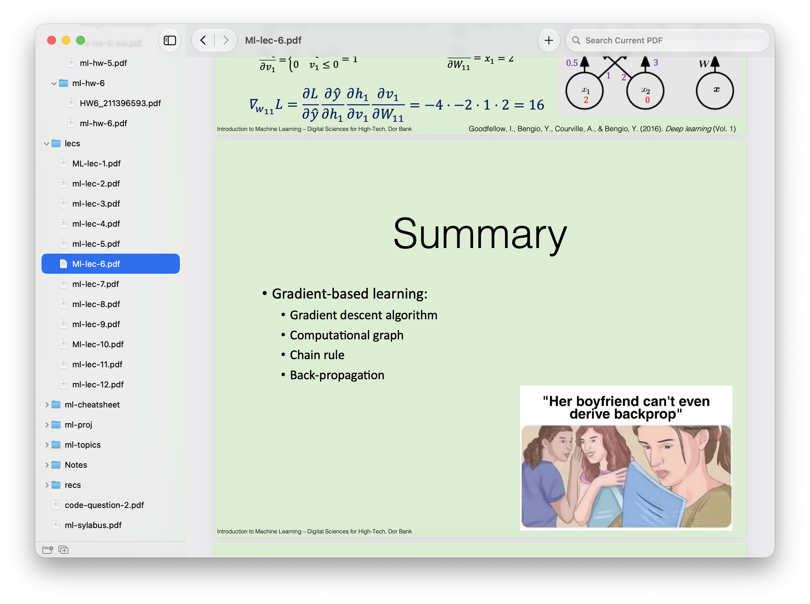

# PDF Navigator

PDF Navigator is a native macOS PDF reader for people who work with collections
of related documents. It combines a familiar Preview-style reading experience
with a project-style sidebar for moving quickly between PDFs in the same
directory tree.


> As a student, I often need to move back and forth between several lecture
> notes, recitations, assignments, and solutions. Preview is excellent for
> reading one document, but it does not provide a fast way to navigate the
> surrounding files. PDF Navigator turns the folder containing those documents
> into a lightweight reading workspace.

The goal is to feel immediately familiar to anyone who uses Preview: native
macOS styling, standard keyboard shortcuts, native tabs, and PDFKit-powered
rendering—plus the directory navigator that Preview is missing.

## Current status

PDF Navigator is an early preview and is not yet distributed as an installer.
The current demo can:

- Open a PDF or folder as a workspace.
- Display PDFs with a lazily loaded directory sidebar.
- Switch documents without leaving the app.
- Move backward and forward through document history.
- Search the current PDF incrementally through PDFKit.
- Open documents in native macOS tabs.
- Restore each document's last reading position.
- Show a basic welcome page when opening a new tab.

## Development

PDF Navigator targets macOS 15 or later.

Open `PDFNavigator.xcodeproj` in Xcode, or build and run the debug app from the
command line:

```sh
./script/build_and_run.sh
```

## Architecture

`PDFNavigatorApp` creates each native window or tab. `WorkspaceView` is the
small visual skeleton, and one `WorkspaceSession` owns that scene's directory
state, selected PDF, and document history. Code is grouped by product
responsibility under `Workspace/`, `Navigator/`, and `Reader/`.

Each `WindowGroup` scene owns an independent `WorkspaceSession`. SwiftUI owns
the scene and split-view state, PDFKit owns page rendering and page navigation,
and `WindowBridge` uses AppKit only where SwiftUI cannot explicitly join native
window tab groups. The navigator scans one directory level when it is opened;
it does not recursively crawl an entire workspace.

## Roadmap

The roadmap describes the current direction of the project and may change as the
interaction model develops.

### Preview releases

#### `0.0.1`

- [x] Build a working PDF reader with a sidebar for switching between documents.
- [x] Add basic search within the current PDF.
- [x] Support native macOS tabs.
- [x] Add a static welcome page showing the current and most recently opened
      workspace.

#### `0.0.2`

- [ ] Allow users to return to the welcome page after navigating away from it.
- [ ] Fix sidebar translucency.
- [ ] Match the denser navigator style used by Finder and Xcode.
- [ ] Add workspace navigation shortcuts:
  - `Command-Up Arrow` to move to the parent directory.
  - `Command-Down Arrow` to enter a selected subdirectory as the workspace.
- [ ] Persist settings, recently opened PDFs, and recent workspaces.
- [ ] Add a sidebar action for opening the current PDF in the default app.

#### `0.0.3`

- [ ] Distribute a DMG or another installer for internal testing.
- [ ] Allow PDF Navigator to be configured as the default PDF reader.
- [ ] Add Preview-style zoom commands: zoom in, zoom out, actual size, and zoom
      to fit.
- [ ] Audit keyboard shortcuts against Preview and native macOS conventions.
- [ ] Add a search action to the bottom of the sidebar.
- [ ] Open folders and PDFs dropped onto the app.
- [x] Expose additional PDFKit capabilities as commands, even if they are not
      yet visible in the toolbar.
- [ ] Use persisted history to build a useful welcome page:
  - Recently opened PDFs in the current workspace.
  - Recently opened PDFs from other workspaces.

### Stable release — `0.1.0`

- [ ] Create a polished app icon.
- [ ] Add screenshots and installation instructions to this README.
- [ ] Optionally publish a small product website.

### Improvements — `0.1.1`

- [ ] Add toolbar customization.
- [ ] Add application settings.

### Stable release — `0.2.0`

- [ ] Add a right sidebar for the table of contents, thumbnails, and document
      information.
- [ ] Add basic bookmarks, annotations, and highlighting using PDFKit.
- [ ] Add iPad support.
